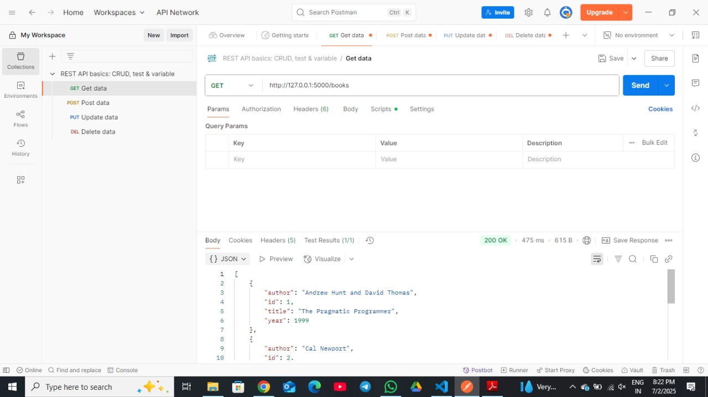

# RESTFUL API DEVELOPMENT

*COMPANY* : CODETECH IT SOLUTIONS

*NAME* : S HARI SHANKAR

*INTERN ID* : CT04DH297

*DOMAIN* : SOFTWARE DEVELOPMENT

*DURATION* : 4 WEEKS

*MENTOR* : NEELA SANTHOSH

This is a simple RESTful API project developed for managing a library system.  
It supports full CRUD operations using Python Flask and JSON data storage.

## 📌 Table of Contents
- [About]
- [Features]
- [Technologies Used]
- [Project Setup]
- [API Endpoints]
- [Screenshots]
- [How to Test with Postman]
- [Author]

## 📖 About

This project is designed to demonstrate how to:
- Build a RESTful API using Flask
- Store and manipulate data in a JSON file
- Perform CRUD operations without a frontend
- Test APIs using Postman

📁 The API is designed for a library/inventory system, where each book has:
- id
- title
- author
- year

## 🌟 Features

- View all books (GET)
- View book by ID (GET)
- Add new books (POST)
- Update existing books (PUT)
- Delete books (DELETE)
- Tested completely using *Postman*

## ⚙ Technologies Used

- [✔] Python 3.x  
- [✔] Flask  
- [✔] JSON (for storage)  
- [✔] Postman (for testing)

You're absolutely right, HARI SHANKAR! 👏
To make it 100% complete, I’ll now give you detailed content for the 4 missing sections you mentioned:

---

🔧 Paste this in your README.md under the correct headings:

---

🛠 Project Setup

Here’s how to set up and run the project on your local machine:

1. Clone the repository:

git clone https://github.com/[your-username]/Library-REST-API.git
cd Library-REST-API

2. Install Flask:

pip install flask

3. Run the application:

python app.py

4. The server will start on:

http://127.0.0.1:5000

You are now ready to test the API using Postman!

📡 API Endpoints

Method	Endpoint	Description

GET	/books	Retrieve all books
GET	/books/<id>	Retrieve a book by ID
POST	/books	Add a new book
PUT	/books/<id>	Update a book by ID
DELETE	/books/<id>	Delete a book by ID

## 🖼 CRUD Operation Screenshots

### 📖 GET all books

### 📝 POST a new book

### ✏ PUT update a book

### ❌ DELETE a book

🧪 How to Test with Postman

1. Open Postman

2. Create a new request tab

3. Set the method and enter the appropriate URL:

GET → http://127.0.0.1:5000/books

POST, PUT, DELETE → see below

4. For POST and PUT, go to Body → raw → JSON and use this format:

▶ POST (Add Book)

{
  "title": "Atomic Habits",
  "author": "James Clear",
  "year": 2018
}

✏ PUT (Update Book)

{
  "title": "Updated Title",
  "author": "Updated Author",
  "year": 2025
}

❌ DELETE

Use:

DELETE http://127.0.0.1:5000/books/1

✅ You’ll get confirmation messages in JSON responses.

✅ Conclusion

This project demonstrates how to build a functional RESTful API using Flask.

CRUD operations are fully implemented and tested using Postman.

Data is stored in a local JSON file, simulating a basic database.

A clean README.md, screenshots, and Postman collection are provided for easy understanding and testing.

